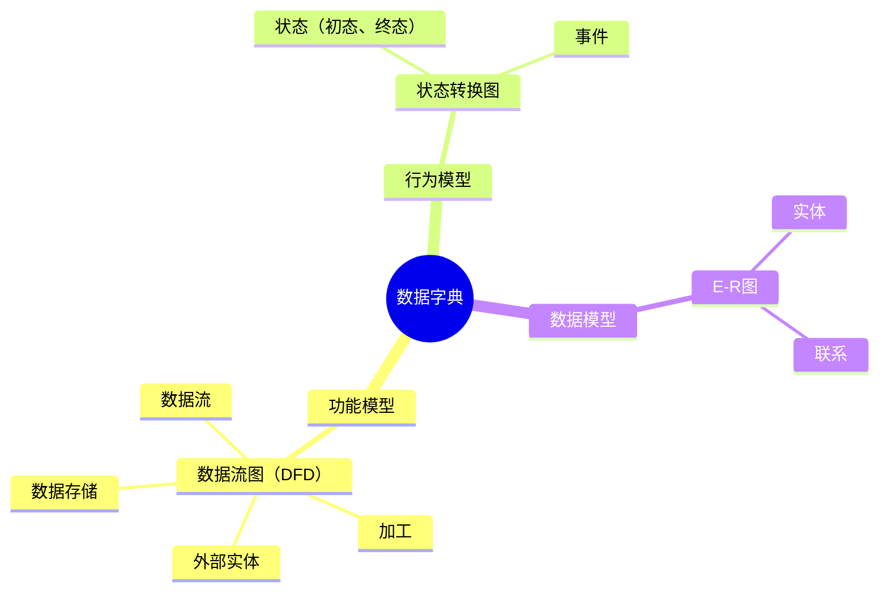
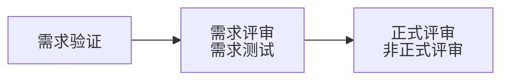

# 需求工程⭐️⭐️

## 1.概述

软件需求：<mark style="color:$danger;">用户</mark>对系统的<mark style="color:$danger;">功能、行为、性能、设计约束</mark>等方面的期望。

— 主要活动的阶段划分

* 需求获取
* 需求分析
* 形成需求规格（形成SRS）
* 需求确认与验证（形成<mark style="color:$danger;">需求基线</mark>（经过评审的SRS（Software Requirements Specification）））
* 需求（对【<mark style="color:$danger;">需求基线</mark>】进行管理）管理（变更控制、版本控制、需求跟踪、需求状态跟踪）

## 2.软件需求获取

### 2.1.获取方法

* 用户面谈：1对1-3，有代表性的用户，了解主观想法，交互好。<mark style="color:$danger;">成本高，要有领域知识支撑</mark>。
* 需求专题讨论会（联合需求计划，JRP）：<mark style="color:$danger;">高度组织的群体会议，各方参与，了解想法，消除分歧，交互好，成本高。</mark>
* 问卷调查：<mark style="color:$danger;">用户多</mark>，无法一一访谈，<mark style="color:$danger;">成本低。</mark>
* 现场观察：针对较为<mark style="color:$danger;">复杂的流程</mark>和操作<mark style="color:$danger;">。</mark>
* 原型化方法：通过简易系统方法<mark style="color:$danger;">解决早期需求不确定问题。</mark>
* 头脑风暴法：一群人围绕新业务，<mark style="color:$danger;">发散思维</mark>，不产生新的观点。

### 2.2.分层

— 业务需求（整体全局）

— 用户需求（用户视角）

— 系统需求（计算机化）

* 功能需求
* 性能需求（非功能）
* 设计约束

### 2.3.QFD（**Quality Function Deployment**‌，质量功能展开/映射）-项目管理维度

* 基本需求（明示，常规需求）
* 期望需求（隐含）
* 兴奋需求（多余）

## 3.需求分析

### 3.1.数据字典

— 数据字典

* 数据元素
* 数据结构
* 数据流
* 数据存储
* 加工逻辑
* 外部实体

### 3.2.OOA 面向对象分析

<mark style="color:$danger;">**UML(统一建模语言)：平台无关、语言无关**</mark>

#### 3.2.1.构造块

— 事物

* 结构事物：最静态的部分，包括：类、接口、协作、用例、活动类、构件和节点
* 行为事物：代表时间和空间上的动作。包括：消息、动作次序、连接。
* 分组事物：看成是个盒子，如：包、构件。
* 注释事物：UML模型的解释部分。描述、说明和标注模型的元素。

— 关系

— 图

#### 3.2.2.规则

— 范围：给一个名字以特定含义的语境

— 可见性：怎样使用或看见名字

— 完整性：事物如何正确、一致地相互联系

— 执行：运行或模拟动态模型的含义是什么

#### 3.2.3.公共机制

— 规格说明：事物语义的细节描述，它是模型真正的核心

— 修饰：通过修饰来表达更多的信息

— 公共分类：类与对象、接口与实现

— 拓展机制：允许添加新的规则

#### 3.2.3.UML图

— 静态图（结构图）

* 类图：一组类、接口、协作和它们之间的关系
* 对象图：一组对象及它们之间的关系
* 构件图：一个封装的类和它的接口
* 部署图：软硬件之间的映射
* 制品图：系统的物理结构
* 包图：由模型本身分解而成的组织单元，以及它们之间的依赖关系
* 组合结构图

— 动态图（行为图）

* 用例图：系统与外部参与者的交互
* 顺序图：强调按时间顺序
* 通信图（协作图）
* 状态图：状态转换变迁
* 活动图：类似程序流程图，并行行为
* 实时图：强调实际时间
* 交互概览图

— UML(4+1视图)

<pre class="language-mermaid"><code class="lang-mermaid">mindmap
  root((用例视图（use-case view）
  最终用户 
  需求分析模型))
    逻辑视图（logical view）
      系统分析、设计人员
      类与对象
<strong>    实现视图（implementation view）
</strong>      程序员
      物理代码文件和组件
    进程视图（process view）
      系统集成人员
      线程、进程、并发
    部署视图（deployment view）
<strong>      系统和网络工程师
</strong>      软件到硬件的映射
</code></pre>

## 4.需求定义

### 4.1.需求开发

#### 4.1.1.需求定义

— 严格定义法

* <mark style="color:$danger;">所有需求都能够被预先定义</mark>
* 开发人员与用户之间能够准确而清晰地交流
* 采用图形/文字可以充分体现最终系统

— 原型法

* <mark style="color:$danger;">并非所有的需求都能在开发前被准确的说明</mark>
* 项目参加者之间通常都存在交流上的困难
* 需要实际的、可供用户参与的系统模型
* 有合适的系统开发环境
* 反复是完全需要和值得提倡的，需求一旦确定，就应遵从严格的方法

#### 4.1.2.需求验证

* 用户签字确认
* 验收标准之一

#### 4.1.3.需求跟踪

<table data-full-width="true"><thead><tr><th align="center">原始需求/用例</th><th>UC-1</th><th>...</th><th>UC-n</th></tr></thead><tbody><tr><td align="center">FR-1</td><td></td><td></td><td></td></tr><tr><td align="center">.</td><td></td><td></td><td></td></tr><tr><td align="center">FR-n</td><td></td><td></td><td></td></tr></tbody></table>

| 用例/元素 | 功能点 | 设计元素 | 代码模块 | 测试用例 |
| :---: | :-: | ---- | :--: | ---- |
|  UC-1 |     |      |      |      |
|   .   |     |      |      |      |
|  UC-n |     |      |      |      |
